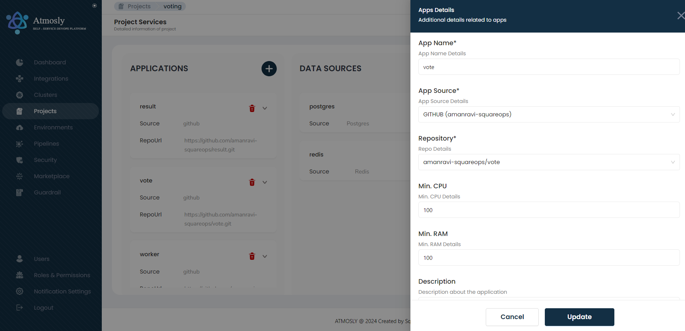
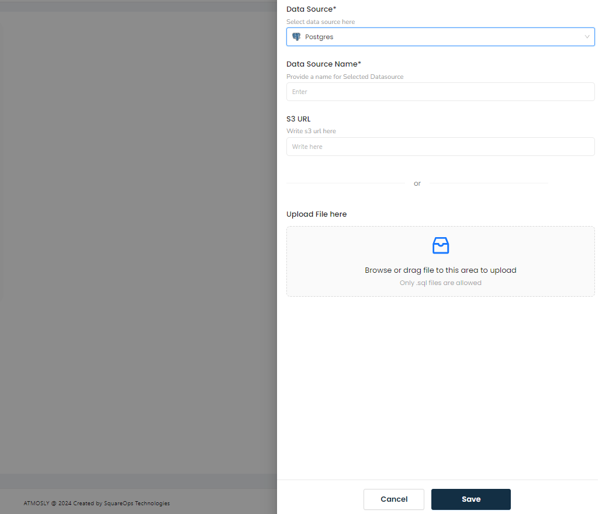
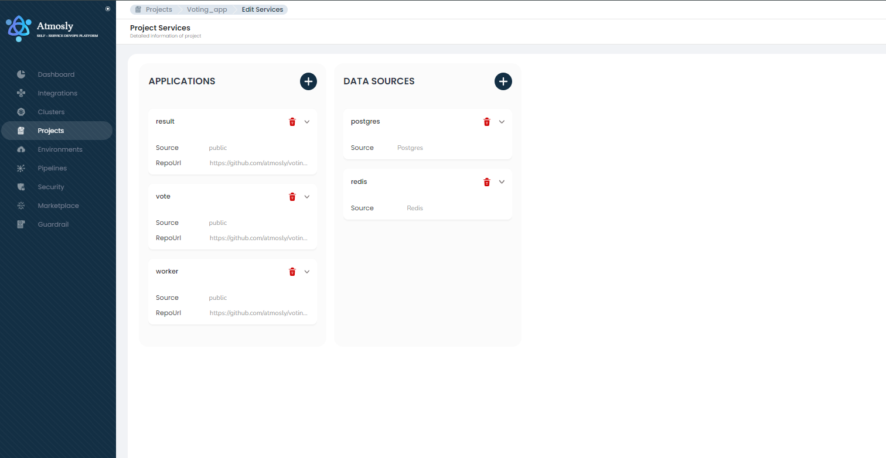
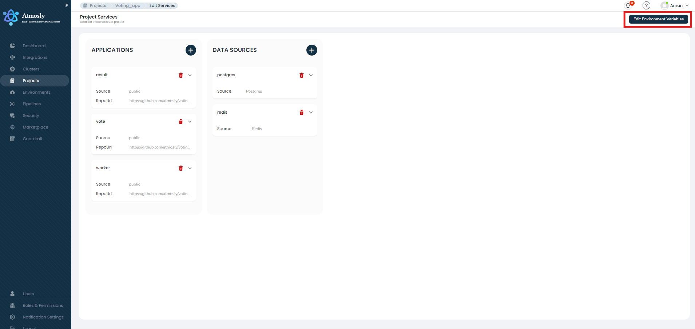
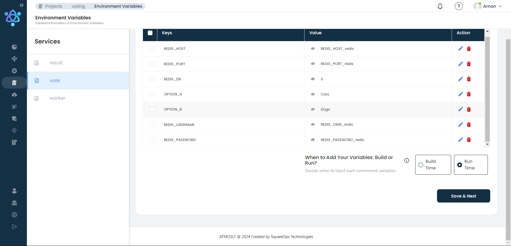
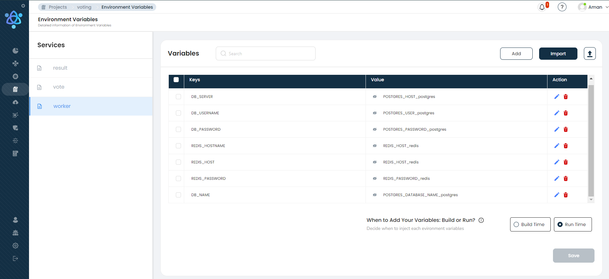
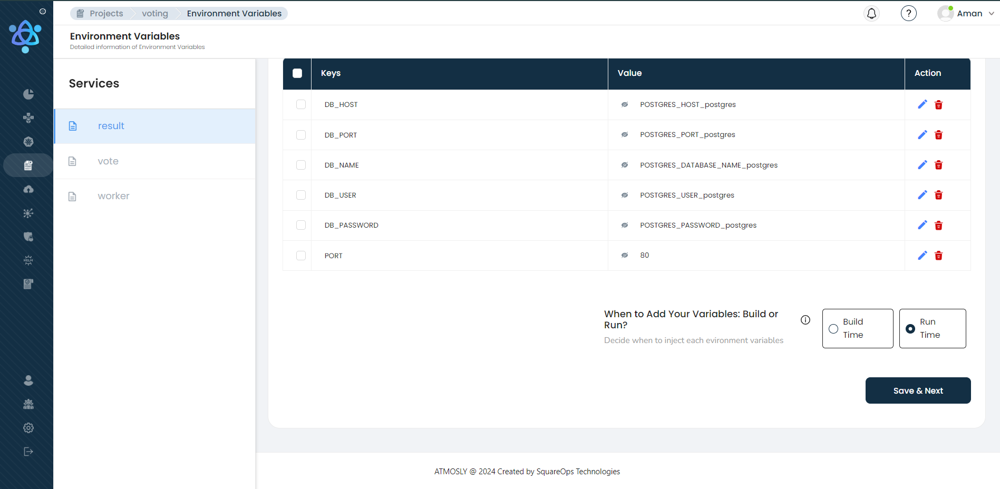

# Deploying Voting App with Atmosly 
 Welcome to the Atmosly deployment guide! This README will walk you through the steps to deploy Voting app on our platform.
 
Before we begin: 
1. [Here](https://docs-test.atmosly.com/docs/atmosly/what_is_atmosly) is a quick introduction of Atmosly.
2. [Here](https://docs-test.atmosly.com/docs/atmosly/before_you) is where you can learn about common terminologies that we will be using throughout this document.
Through this document, we will be deploying Voting application on Atmosly. [Listed here](https://docs-test.atmosly.com/docs/atmosly/deploy_your_first_application) is a brief of all the steps we will be following to successfully deploy the application. 
 
## About the Voting App
GitHub URL - https://github.com/dockersamples/example-voting-app. 
This application consists of five microservices -
 - Vote (python) - from where end user would cast a vote
 - Result (react) - where the results of the voting are stored 
 - Worker (dot net)
 - Postgresql
 - Redis
 ## Prerequisites
- An account on [Atmosly](https://app.atmosly.com/signup) 
Follow the steps here to sign up on Atmosly.
- A cloud account integrated   Follow the steps [here](https://docs-test.atmosly.com/docs/general/Integrations) to integrate your AWS account.
> PLEASE NOTE: we only have support of AWS on the platform right now.
- A cluster ready on Atmosly
Follow the steps [here](https://docs-test.atmosly.com/docs/clusters/create_cluster) to create a cluster on Atmosly.  
## Setup
We have an open source project available for the Voting App. 
### What are Projects:
Projects is an application blueprint on Atmosly where we define basic details for an application.  
Projects module have three elements:
1. Applicaton services
2. DataSource services
3. Environment Variables   
You can find more details about the Project module [here](https://docs-test.atmosly.com/docs/projects/create_project). 
### To make a new project: 
#### Step 1: 
For the application services, you will need to click on the "+" icon in Applications and add Vote microservice as per screenshot below. 
Adding Vote Microservice:

For all other application microservices, i.e. Result and Worker, follow a similar structure as with the Vote microservice. Repo would be considered service's repo. 
#### Step 2: 

For the database, you will need to click on the "+" icon in Data Sources and add PostgreSQL and Redis individually.  

  

Once you have added both application and datasource services, it would look like this:  

Now, to manage dependency in between applications, you can use environment variables to tell the, for example, Website Service where to find the Database Service. 
#### Step 3: 
a. Click on the **Edit Environment Variable** button. 

  

You have two choices for adding environment variables:
1. Importing/ selecting the .env file from GitHub branch - by clicking on the **Import** button.
2. Manually adding it by clicking the **Add** button - in the case where you would like to manually define your variables or add to the list of environment variables, you can also add your variable manually. 
We will import our variables for the services - 
1. Vote microservice variables - Click on **Import** button and select 'main' as branch and select .env.vote as the file and click on **Proceed**.
2. Result microservices variables - Click on **Import** button and select 'main' as branch and select .env.result as the file and click on **Proceed**.
3. Worker microservice variables - Click on **Import** button and select 'main' as branch and select .env.worker as the file and click on **Proceed**.
The final screen after the environment variables have been added would look something like this - 

Vote: 

 

Worker: 

 

Result: 

Great! Our basic setup is completed. Now, let's create an environment for deploying the application on EKS cluster.
## Deployment
By this time you have: 
1. Successfully integrated a cloud account
2. Successfully created a cluster
3. Have a Voting App project
To create environment, follow the steps mentioned [here](https://docs.atmosly.com/docs/environments/create_env) with the information required.
Please note, you will need to pass the following details to deploy Voting App - 
Voting app (for result, vote and worker services)
1. Branch: 
    - result: main
    - vote: main
    - worker: main
2. Dockerfile Path: 
    - result: result/Dockerfile
    - vote: vote/Dockerfile
    - worker: worker/Dockerfile
3. Build Context: 
    - result:
    - vote:
    - worker: 
3. port: 
    - result: 80
    - vote: 80
    - worker: 80
4. endpoint type:  
    - result: public load balancer
    - vote: public load balancer
    - worker: cluster IP 
5. min-max CPU : 500m-1000m for all application services
6. min-max memory : 1000mi-2000mi for all application services